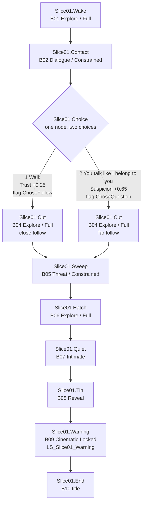

# AFTERLIGHT Vertical Slice — State Graph

Status: **Design only.** Do not implement in this milestone.

Compatible with existing systems:

- Flags: `FGameplayTag` on `UAfterlightNarrativeSubsystem`
- Beats: `UAfterlightBeatAsset` (id, required/grant flags, dialogue, camera, sequence, next)
- Choice: `FAfterlightDialogueChoice` (text, grant flags, TrustDelta, SuspicionDelta, next node)
- Relationship: Trust / Suspicion, clamp `[0,1]`, thresholds TrustHigh **0.7**, SuspicionHigh **0.6**
- Camera registers and cinematic coordinator as already shipped

Start state matches current defaults so Slice 01 does not require relationship-code changes:

- Trust **0.50**
- Suspicion **0.00**
- Beat `Slice01.Wake`
- Flags empty

---

## Beat chain



Convergence is immediate: both choice flags lead to the same `Slice01.Cut` beat. Follow distance and Maya performance read the relationship tags, not a second beat graph.

---

## Flags

| Flag | Granted by | Required by |
|---|---|---|
| `Story.Slice01.Woke` | Wake begin | Contact |
| `Story.Slice01.MetMaya` | Contact Talk | Choice |
| `Story.Slice01.ChoseFollow` | Choice 1 | — (mutex with Question) |
| `Story.Slice01.ChoseQuestion` | Choice 2 | — (mutex with Follow) |
| `Story.Slice01.EnteredCut` | Cut volume | Sweep |
| `Story.Slice01.ReadNotice` | Optional inspect | — |
| `Story.Slice01.SweepPassed` | Drone leaves | Hatch door |
| `Story.Slice01.ReachedBolt` | Door Use | Quiet |
| `Story.Slice01.QuietBeat` | Mug hold completes | Tin interactable |
| `Story.Slice01.LookedPhoto` | Optional inspect | — |
| `Story.Slice01.FoundTin` | Tin Inspect | Warning |
| `Story.Slice01.HeardWarning` | Sequence finished | End |
| `Story.Slice01.Complete` | Title | — |

Mutex: if `ChoseFollow` is granted, do not grant `ChoseQuestion`, and the reverse.

---

## Choice node (dialogue runner)

Node `Choice` (after Maya’s “I will not get you out of that.”):

| | Text | TrustDelta | SuspicionDelta | GrantFlags | Next |
|---|---|---|---|---|---|
| 1 | Walk. | **+0.25** | 0 | `ChoseFollow` | Cut |
| 2 | You talk like I belong to you. | 0 | **+0.65** | `ChoseQuestion` | Cut |

Resulting state:

| Path | Trust | Suspicion | Presentation tags (existing) |
|---|---|---|---|
| Follow | 0.75 | 0.00 | `Relationship.Trust.High`, `Companion.Follow.Close` |
| Question | 0.50 | 0.65 | `Relationship.Suspicion.High`, `Companion.Follow.Far` |

No affection meter. Tags drive distance, touch, joke, sit/stand as specified in the bible.

---

## Conditions

```
Talk available:     Woke && !MetMaya && in range
Choice available:   MetMaya && !ChoseFollow && !ChoseQuestion
Cover available:    EnteredCut && !SweepPassed && player not in hide volume
Door Use:           SweepPassed && !ReachedBolt
Tin Inspect:        QuietBeat && !FoundTin
Photo Inspect:      ReachedBolt (optional, forever)
Sequence play:      FoundTin && !HeardWarning
Title:              HeardWarning
```

Walk-and-talk lines on Cut are not a second dialogue asset with choices. They are fire-and-forget companion lines gated by `EnteredCut && !SweepPassed`.

---

## Cinematic session

```
RequestCinematic(LS_Slice01_Warning, ReturnRegister=Intimate, BlendOut=0.8)
Input = Locked
OnFinished -> Intimate on Maya, then Constrained
Cancel/Load -> ReleaseCinematic, do not remain Cinematic
```

Same coordinator model as the lab inspect proof. New sequence asset; no new authority type.

---

## Save / load (debug)

Persist: flags, current beat id, Trust, Suspicion.

On load:

- Restore Maya follow from relationship tags.
- If beat was Warning and sequence was mid-play, cancel and restart Warning from tin already found, or skip to End if `HeardWarning`.
- Never leave input Locked without an active session.

---

## What we are not graphing

- Combat states
- Full five-axis relationship
- Multiple endings
- Helion as a faction reputation track
- A second map
